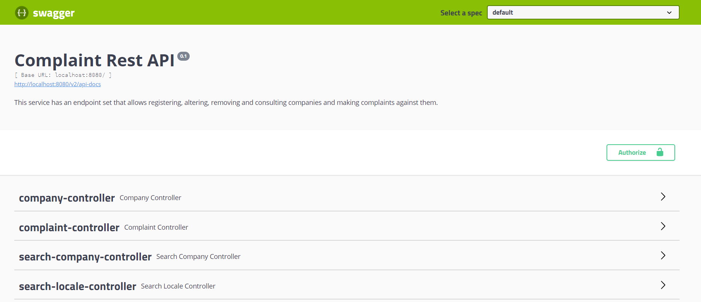
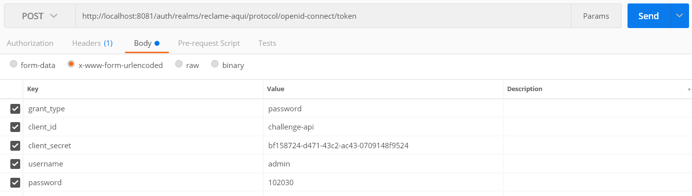
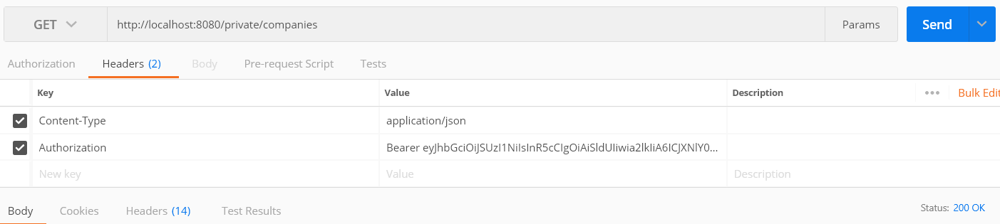

### About this project

# Backend Engineer Challenge

this project is a implementation of a set services for the registration and management of complaints and companies data. In addition, it is possible to search collection data about complaints against companies and filtering according geolocation.


## Project Structure

The project has been implemented as a set of microservices that are structured as a separated project contained in this repository. The services are:

  
* API Restful service
* Database service
* Keycloak service


### API restful service

The API restful service has an endpoint set that allows registering, altering, removing and consulting companies and making complaints against them. The existing endpoints in this service are:

#### companies endpoints

  
* GET: /private/companies
* GET: /private/companies/{id}
* POST: /private/companies
* PUT: /private/companies/{id}
* DELETE: /private/companies/{id}

#### complaints endpoints

* GET: /private/complaints
* GET: /private/complaints/{id}
* POST: /private/complaints
* PUT: /private/complaints/{id}
* DELETE: /private/complaints/{id}

#### search complaints endpoints

* GET: /public/companies/{cnpjCompany}
* GET: /public/companies/{cnpjCompany}/locale/{state}
* GET: /public/companies/{cnpjCompany}/locale/{state}/{city}
* GET: /public/locale/{state}
* GET: /public/locale/{state}/{city} 

The implementation technologies used in this service are:

*  **Language:** Java
*  **Spring boot** 
*  **Spring security**
*  **Swagger**
*  **port:** 8080


### Database service

The implementation technologies used in this service are:

*  **Database:** MongoDb
*  **port:** 27017


### Keycloak Service

The keycloak is an open source service which allows single login and unified access management. The keycloak is maintained by redhat.  

This service uses the keycloak with a configuration to allow authentication and authorization of access to the private endpoints of the API rest service.

The settings made in the keycloak were:

* created a *reclame-aqui* realm
* created a *challenge-api* client using openid-connect client protocol and acess type confidential
* created *user* and *role* admin

The enpoints for authorization and refresh token are:

* GET: http://host.docker.internal:8081/auth/realms/reclame-aqui/protocol/openid-connect/auth
* GET: http://host.docker.internal:8081/auth/realms/reclame-aqui/protocol/openid-connect/token

The keycloak access credentials are:

*  **user:** admin
*  **password:** admin

# Running the Project

  
To run the services for this project, it is necessary to use Docker compose from the docker-compose.yml files that are at the root of the keycloak directory and at the root of the project directory. 

Before running Docker Compose, it is necessary to insert the following line in the host file:

```bash
127.0.0.1 host.docker.internal
```

Now, to run this project:
```bash
git git@github.com:marciofraga/challenge.git
cd keycloak
docker-compose up
cd ..
docker-compose up
```
  

O Docker Compose will read docker-compose.yml file and downloaded all container image and start the service.

  

After Docker Compose finished, all services are up and running at:

  

- API Service: `http://docker.host.internal:8080`
- Keycloak Service: `http://docker.host.internal:8081`


## test API service

  

The Api rest service comes with swagger documentation configured to allow testing of endpoints. To access the swagger, go to `http://host.docker.internal:8080/swagger_ui.html`.

  



  
It is also possible to test the api rest service using the postman. For this, it is necessary to first obtain the authorization token in the keycloak and then send the requests in the Api rest service.

  

1. sending access authorization request



2. sending GET request for endpoint `http://localhost:8080/private/companies`



The Keycloak service come with the following test user:

**user:** admin
**password:** 102030